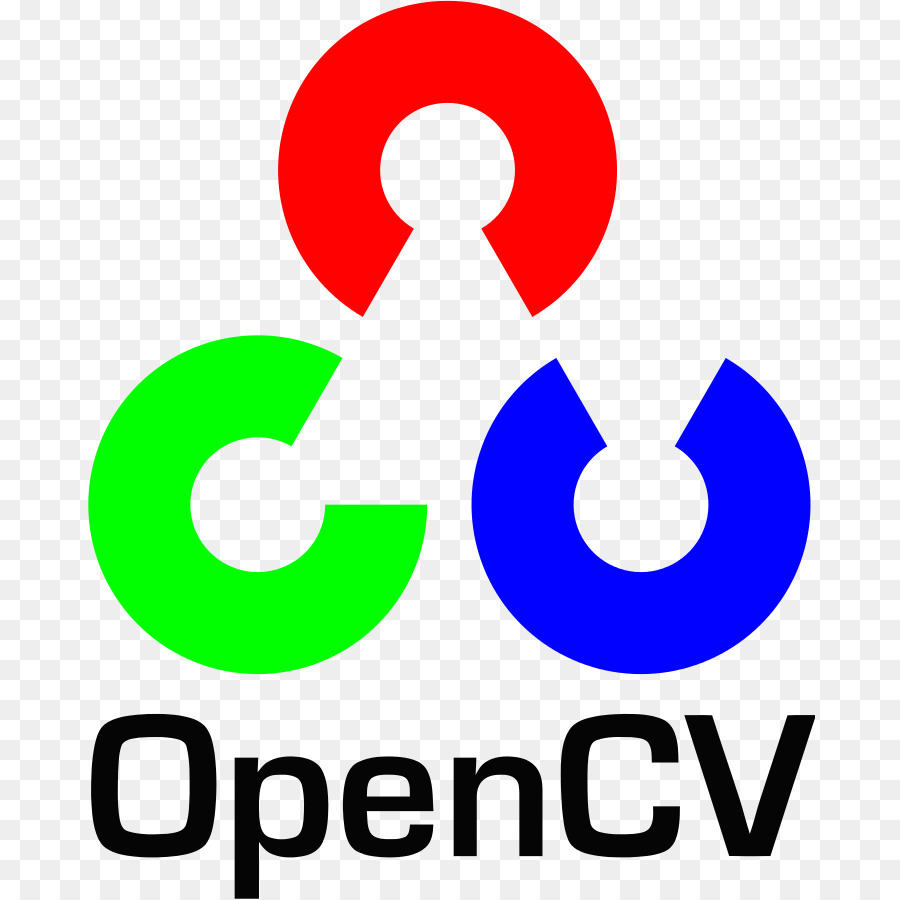

<h2 align="center">Hello there 👋 It's Jugal Kishore Chanda 😃 </h2>
<h4 align="center"><i> 🌱 Web Developer 🌱</i></h4>
 

  

  

<!-- 

- 🌱 I’m currently learning everything 🤣

 -->

<h3 align="center">Technical Skills</h3>
<h4>Programming Languages</h4>

<code></code>
<code></code>
<code></code>
<code></code>
<code></code>
<code></code>

<h4>Scripting Languages</h4>

<code></code>
<code></code>

<h4>FrameWorks</h4>

<code></code>
<code></code>
<code></code>

<h4>Library Used</h4>

<code></code>
<code></code>
<code></code>

